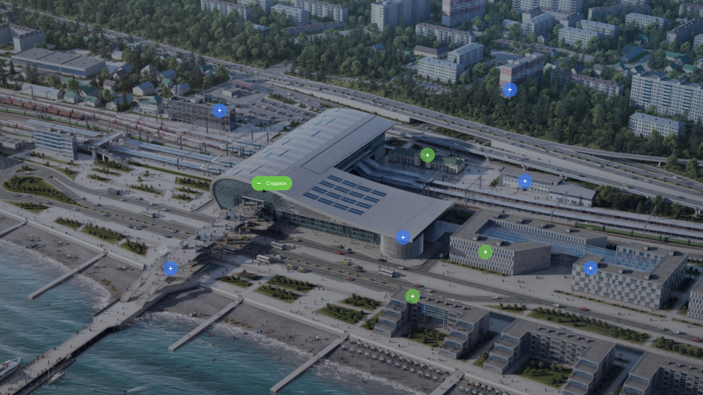

# only-test-task

## Description
Implement the block according to the layout in Figma.

**The project is available at the link**: (https://khairullinamm.github.io/only-test-task/)

**Basic requirements:**
1. Use HTML5, CSS3, JS
2. All buttons should not lose their position on the screen width in the range from 1920px to 1280px
3. There should not be more than one “click” event handler on the page at the same time

## Features
1. When you click on each button, it "opens" and a text appears
2. When you click on the button again or click on the background image, the button "closes"
3. Custom cursor

## Project status
_Project is: complete._

## Contacts 
[@milanahmm](https://t.me/milanahmm) - contact me!

